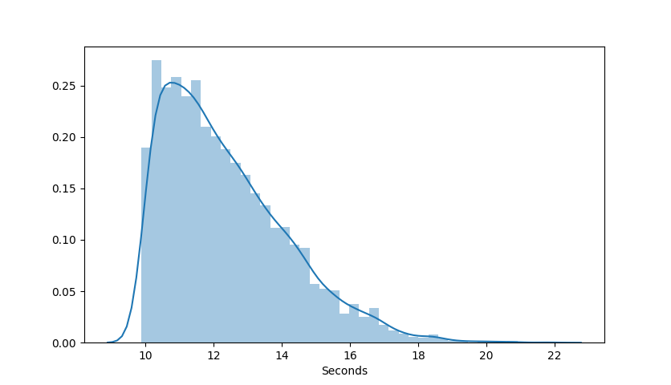

# Girder Job Mocking tool

The following package provides the tool ```girder-jobmock``` which can be used to create Jobs in Girder using a number of different patterns. It does not do any actual processing and is intended to be used to develop novel visualizations of Jobs and their relationships. 

## Install

Close the repository and create a virtual environment.
**NOTE** You must use Python >= 3.5

```
mkdir jobmock
git clone git@kwgitlab.kitware.com:chris.kotfila/girder_jobmock.git .
makevirtualenv -a . -ppython3 jobmock 
workon jobmock
```

Install the package
```
pip install .
```

## Example Usage

Create a single Job
```
$> girder-jobmock single
```

Create a single Job with a transition delay between running and success of 2 seconds
```
$> girder-jobmock single -d 2
```

Run a basic workflow
```
$> girder-jobmock workflow -d 2
```

Create a group of 10 jobs
```
$> girder-jobmock group -n 10
```

Create a group of 10 jobs with transition delays taken from a normal distribution with mean 10 seconds, variance 5
```
$> girder-jobmock group -n 10 -d 10 -d 5
```


Create a group of 10 jobs with transition delays taken from a skewed normal distribution with mean 10 seconds, variance 3 and skew 50, transition ~30% to error instead of success.
```
$> girder-jobmock group -n 10 -d 10 -d 5 -d 50 -e 0.3
```

Visualize a skewed normal distribution with mean 10 seconds, variance 3 and skew 50

```
$> girder-jobmock dist -d 10 -d 5 -d 50
```


